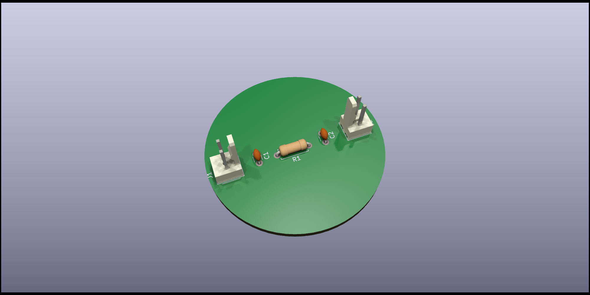
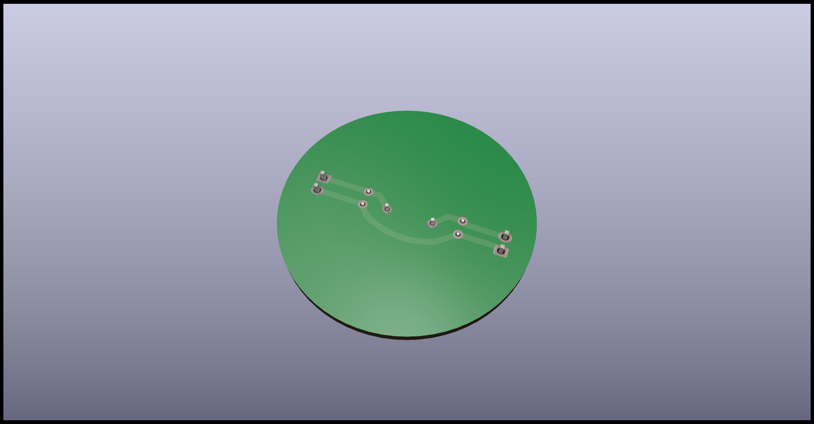
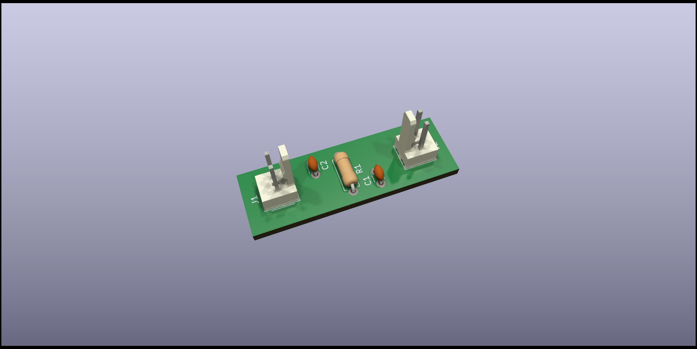
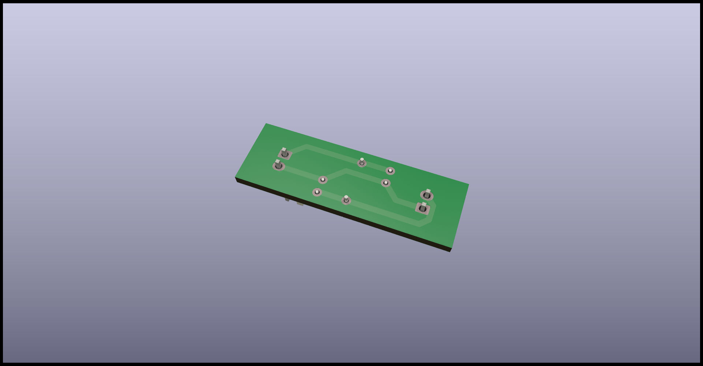

# One schematic and two different PCBs

This example shows one way to handle a situation where we have one schematic
and we want to create two different PCBs from the same circuit.

The proposed solution is to use one schematic and two KiCad projects.
Each project includes the same schematic using a hierarchical sheet.

In this way we get two different PCBs, one for each project, but both with
the same circuit.

## PCB 1

[Schematic](PCB_1/Generated/Schematic.pdf)

[PCB](PCB_1/Generated/PCB_1-assembly.pdf)

## PCB 2

[Schematic](PCB_2/Generated/Schematic.pdf)

[PCB](PCB_1/Generated/PCB_2-assembly.pdf)

