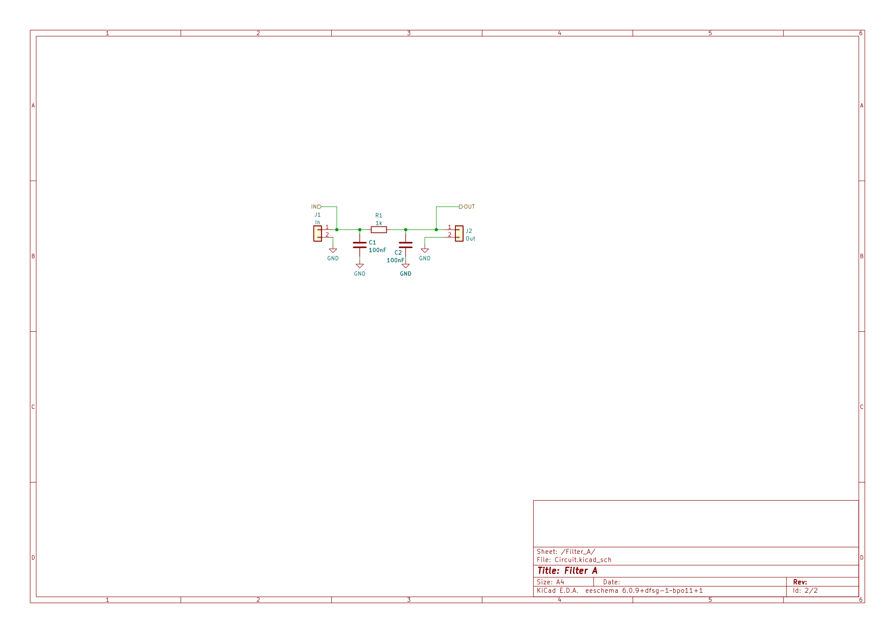

# Multi-board projects

## Problem

We have a project we two or more PCBs. It can be as simple as a power source board and the main board.

In KiCad a project can handle a schematic hierarchy and just one PCB.

Here we try to explore possible solutions.

## Solution 1: Using KiKit

Here the idea is that you make one schematic containing all the circuit and one board file containing all the PCBs.
Then you use the `kikit separate` command to separate the PCBs.

Here is a simple example:

Our circuit is divided in two boards. Each board contains one filter.
They are connected with a cable between J2 and J3.

The KiCad board file looks like this:

The `Board A` and `Board B` arrows are used to name each PCB.
After running `kikit separate` we get for board A:

And for board B:

### Problems

* You have only one stack-up because both circuits comes from the same KiCad PCB file.
* Both circuits gets the same worksheet information (title, revision, etc.)
* You must avoid using global power components. No GND or +5V for global use.
* You need an external tool to separate the PCBs.
* You can't check electrical rules for connections between the boards.

## Solution 2: Using hierarchical sheets

This looks a little bit more complicated, but solves various problems.

You create individual projects for each PCB board. In our example one project for each filter.

So you have individual pages (or hierarchies) for each part of the circuit, each page belongs to its own project:

Note that we added hierarchical labels to all the connectors.

In order to avoid problems when running the ERC we wrap each filter using a hierarchical sheet.
So Filter A full schematic becomes:

And Filter B schematic:

With two separated projects we have two separated PCBs.
Filter A:

Filter B:

In order to create a schematic for the whole system you create a third project.
In this project you use hierarchichal sheets to join both projects and show
how they are connected.

Note that running the ERC will check the connection between boards.

### Why we use a top-level for each sub-circuit?

This allows running the ERC on each project.
For this we need PWR_FLAG components. If we are them in the real circuit,
not at the top-level of the individual board, we will have more than one
PWR_FLAG connected to the same node when we join the circuits at the
system top-level. This generates ERC errors.

If you don't need to run ERC for individual boards, only for the full
system, you can remove these sheets.

### Problems

* The top level sheets for each individual board has repeated information.
* You must be careful with the power between boards.
  As an example: If you forget to connect GND using a connector the ERC
  won't catch this error because its connected using the global GND.
  As a solution you could use different GND symbols for each board.
